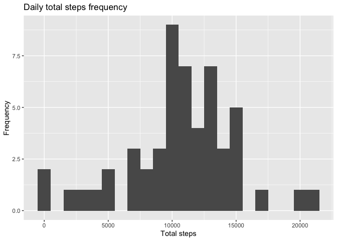
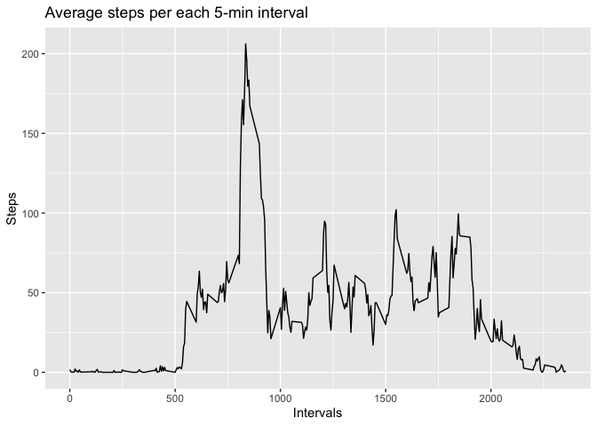
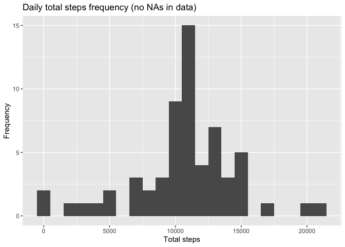
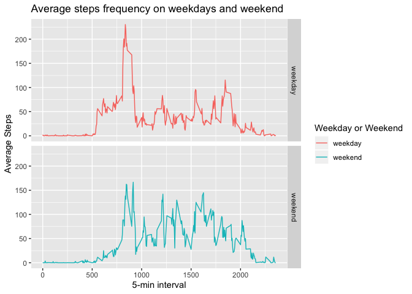

```r
  library(knitr)
  opts_knit$set(root.dir=normalizePath('./'))
  opts_chunk$set(fig.path = "./figure/")
```

## Loading and preprocessing the data

Here I'm reading the __activity.zip__ file stored into the repository which contains the data regarding the two months of data from an anonymous individual collected during the months of October and November, 2012 and include the number of steps taken in 5 minute intervals each day.


```r
# Unzip the file manually as the automatic unzip using read.csv is returning an error. 
unzip("activity.zip")

# Read CSV file into activity_data.
activity_data <- read.csv("activity.csv", header = TRUE, sep = ",")
```

To validate the data was loaded correctly, I'm displaying some info regarding the __activity_data__ dataset as follows.


```r
# Get first 6 elements.
head(activity_data)
```

```
##   steps       date interval
## 1    NA 2012-10-01        0
## 2    NA 2012-10-01        5
## 3    NA 2012-10-01       10
## 4    NA 2012-10-01       15
## 5    NA 2012-10-01       20
## 6    NA 2012-10-01       25
```

```r
# Check amount of rows and columns. 
dim(activity_data)
```

```
## [1] 17568     3
```

```r
# Check variables names. 
names(activity_data)
```

```
## [1] "steps"    "date"     "interval"
```

```r
# Check summary overall info.
summary(activity_data)
```

```
##      steps                date          interval     
##  Min.   :  0.00   2012-10-01:  288   Min.   :   0.0  
##  1st Qu.:  0.00   2012-10-02:  288   1st Qu.: 588.8  
##  Median :  0.00   2012-10-03:  288   Median :1177.5  
##  Mean   : 37.38   2012-10-04:  288   Mean   :1177.5  
##  3rd Qu.: 12.00   2012-10-05:  288   3rd Qu.:1766.2  
##  Max.   :806.00   2012-10-06:  288   Max.   :2355.0  
##  NA's   :2304     (Other)   :15840
```

```r
# Check variable classes.
class(activity_data$steps)
```

```
## [1] "integer"
```

```r
class(activity_data$date)
```

```
## [1] "factor"
```

```r
class(activity_data$interval)
```

```
## [1] "integer"
```

So, as you can see, the data is loaded correctly. There are 17568 observations and 3 variables ("steps", "date" and "interval"). 

* The __steps__ variable contains integer data and 2304 NAs values. 
* The __date__ variable contains date string values as factors.
* The __interval__ variable contains integer data. 

I'm gonna transform the __date__ variable from string factor into Date. 


```r
# Transform date variable from String to Date.
activity_data$date <- as.Date(activity_data$date, "%Y-%m-%d")

# Validate transformation. 
class(activity_data$date)
```

```
## [1] "Date"
```

## What is mean total number of steps taken per day?

Let's calculate first the total number of steps per day. 


```r
library(dplyr)
```

```
## 
## Attaching package: 'dplyr'
```

```
## The following objects are masked from 'package:stats':
## 
##     filter, lag
```

```
## The following objects are masked from 'package:base':
## 
##     intersect, setdiff, setequal, union
```

```r
# Calculate the total number of steps per day. 
total_steps_day <- activity_data %>%
  group_by(date) %>%
  summarise(total_steps = sum(steps))

# Check the first 6 elements. 
head(total_steps_day)
```

```
## # A tibble: 6 x 2
##   date       total_steps
##   <date>           <int>
## 1 2012-10-01          NA
## 2 2012-10-02         126
## 3 2012-10-03       11352
## 4 2012-10-04       12116
## 5 2012-10-05       13294
## 6 2012-10-06       15420
```

Let's display the total number of steps into a histogram. 


```r
library(ggplot2)

# Display the frequency of steps per day. 
ggplot(total_steps_day, aes(x = total_steps)) +
  geom_histogram(binwidth = 1000) +
  labs(title = "Daily total steps frequency", x = "Total steps", y = "Frequency")
```

```
## Warning: Removed 8 rows containing non-finite values (stat_bin).
```

<!-- -->

Also, let's calculate the mean and median for the total number of steps per day. 


```r
# Calculate the total number of steps per day. 
(mean_median_steps_day <- total_steps_day %>%
  summarise(mean_steps = mean(total_steps, na.rm = TRUE), 
            median_steps = median(total_steps, na.rm = TRUE)))
```

```
## # A tibble: 1 x 2
##   mean_steps median_steps
##        <dbl>        <int>
## 1     10766.        10765
```

The mean steps per day are 10766 steps and the median are 10765 steps.

## What is the average daily activity pattern?

Here I want to know the average number of steps taken, per each 5-minute interval averaged across all days.


```r
# Calculate the average number of steps per interval. 
avg_steps_interval <- activity_data %>%
  group_by(interval) %>%
  summarise(avg_steps = mean(steps, na.rm = TRUE))

# Check the first 6 elements. 
head(avg_steps_interval)
```

```
## # A tibble: 6 x 2
##   interval avg_steps
##      <int>     <dbl>
## 1        0    1.72  
## 2        5    0.340 
## 3       10    0.132 
## 4       15    0.151 
## 5       20    0.0755
## 6       25    2.09
```

Let's see these values in a time series plot. 


```r
# Display the steps average per each 5-minutes interval in a time series.
ggplot(avg_steps_interval, aes(x = interval, y = avg_steps)) +
  geom_line() +
  labs(title = "Average steps per each 5-min interval", x = "Intervals", y = "Steps")
```

<!-- -->

Let's find out which 5-minute interval, on average across all the days in the dataset, contains the maximum number of steps.


```r
# Get the max average steps value and then filter the dataset using that value to get the interval. 
(max_interval <- avg_steps_interval[avg_steps_interval$avg_steps == max(avg_steps_interval$avg_steps), ])
```

```
## # A tibble: 1 x 2
##   interval avg_steps
##      <int>     <dbl>
## 1      835      206.
```

The 835 interval has the maximum number of steps with 206.1698113 steps.

## Imputing missing values

Let's figure out the number of missing values for each variable.


```r
# Check missing data for steps.
sum(is.na(activity_data$steps))
```

```
## [1] 2304
```

```r
# Check missing data for dates.
sum(is.na(activity_data$date))
```

```
## [1] 0
```

```r
# Check missing data for intervals.
sum(is.na(activity_data$interval))
```

```
## [1] 0
```

As you can see, there are only 2304 NAs in the steps variable.  

So, let's fix that. The strategy will be to fill the missing data using the mean for the 5-min interval.


```r
library(tidyr)

# Replace the NAs using the steps mean by interval. 
activity_data_filled <- activity_data %>%
  group_by(interval) %>%
  mutate(steps = replace_na(steps, mean(steps, na.rm = TRUE)))

# Validate the NAs are filled. 
head(activity_data_filled)
```

```
## # A tibble: 6 x 3
## # Groups:   interval [6]
##    steps date       interval
##    <dbl> <date>        <int>
## 1 1.72   2012-10-01        0
## 2 0.340  2012-10-01        5
## 3 0.132  2012-10-01       10
## 4 0.151  2012-10-01       15
## 5 0.0755 2012-10-01       20
## 6 2.09   2012-10-01       25
```

```r
sum(is.na(activity_data_filled$steps))
```

```
## [1] 0
```

So, after this step I have created a new dataset called __activity_data_filled__ which doesn't contain NAs. 
Let's see how the total number of steps looks like in a histogram after the transformation.


```r
# Calculate the total number of steps per day. 
total_steps_day_filled <- activity_data_filled %>%
  group_by(date) %>%
  summarise(total_steps = sum(steps))

# Display the frequency of steps per day. 
ggplot(total_steps_day_filled, aes(x = total_steps)) +
  geom_histogram(binwidth = 1000) +
  labs(title = "Daily total steps frequency (no NAs in data)", x = "Total steps", y = "Frequency")
```

<!-- -->

So, as you can see the histogram changes slightly. So, what's the new mean and median for the total number of steps taken per day?


```r
# Calculate the new mean and median total number of steps per day. 
(mean_median_steps_day_filled <- total_steps_day_filled %>%
  summarise(mean_steps = mean(total_steps), 
            median_steps = median(total_steps)))
```

```
## # A tibble: 1 x 2
##   mean_steps median_steps
##        <dbl>        <dbl>
## 1     10766.       10766.
```

Basically, they are the same as before. The only difference is that the meadian is now the same as the mean. Which makes sense as we changed the NAs for the mean value of steps per interval. 

## Are there differences in activity patterns between weekdays and weekends?

Let's create a new variables called is_weekday, which will hold the factor with two levels – “weekday” and “weekend”.


```r
library(lubridate)
```

```
## 
## Attaching package: 'lubridate'
```

```
## The following object is masked from 'package:base':
## 
##     date
```

```r
# Create a new variable based on the weekday number returned by lubridate function wday().
# 1 = Sunday and 7 = Saturday. The rest of the numbers are weekdays. 
activity_data_filled <- activity_data_filled %>%
  mutate(is_weekday = ifelse(wday(date) == 1 | wday(date) == 7, "weekend", "weekday"))

# Convert the new variable is_weekday into a factor.
activity_data_filled$is_weekday <- as.factor(activity_data_filled$is_weekday)
```

Finally, let's create a time series plot with 2 panels of the 5-minute interval and the average number of steps taken, averaged across all weekday days or weekend days.


```r
# Calculate the average number of steps taken on weekdays or weekends. 
avg_steps_weekday_interval <- activity_data_filled %>%
  group_by(is_weekday, interval) %>%
  summarise(avg_steps = mean(steps))

# Create line plot with 2 panels comparing the weekday and weekend average steps. 
ggplot(avg_steps_weekday_interval, aes(x = interval, y = avg_steps, col = is_weekday)) +
  geom_line() +
  facet_grid(is_weekday ~ .) +
  labs(title = "Average steps frequency on weekdays and weekend", x = "5-min interval", y = "Average Steps", col = "Weekday or Weekend")
```

<!-- -->
